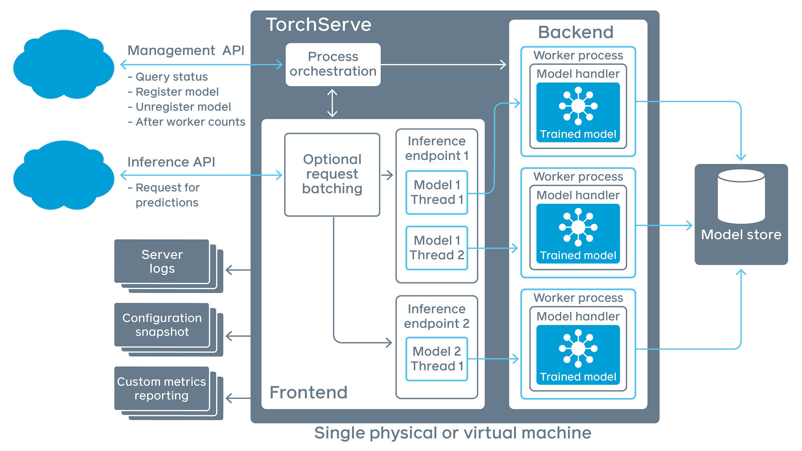

# TOC
- [TOC](#toc)
- [Assignment](#assignement)
- [Torchserve](#TorchServe)

# Assignement

* Do it for your CIFAR trained model.
* Deploy your model to TorchServe in an EC2 Instance/GitPod
  * You have to use scripted model for creating your .mar file
* Write PyTest script (test_serve_cifar.py) for
  * testing REST API Inference
      * Test if the inference output for 10 Images from CIFAR10
      * Images can be taken from here: https://github.com/RubixML/CIFAR-10/tree/master/trainLinks to an external site.
      * Check if the classname is correct
* testing gRPC API Inference
    * Same thing as above, just do with gRPC
* testing captum model explanation
  * Check if the Model Explanation Values Shape returned by Server is correct
  * Also Save the Model Explanations Image
  * Do for any 1 Image from CIFAR10
* Take inspiration from https://github.com/The-School-of-AI/emlov2-session-5-satyajitghana Links to an external site.and  https://github.com/ashleve/lightning-hydra-template/blob/main/tests/test_mnist_datamodule.py
  * Create a folder  `test_serve`
  * Put all your tests inside that
  * Along with any files if needed
  * Run tests with pytest test_serve
  * This should run all your torchserve related test
* The parameter to the test functions should be your TorchServe Server Public IP and Model Name (as per your registered mar name)
   * APIs of TorchServe will not be accessible over internet because it binds to 127.0.0.1 so only 127.0.0.1 can call APIs, to fix it bind to 0.0.0.0, now you can use the public IP of the instance to call APIs. https://pytorch.org/serve/configuration.html#configure-torchserve-listening-address-and-port
   * You can use PyTest fixtures for command line arguments.
   * https://docs.pytest.org/en/7.1.x/how-to/parametrize.html
* Create `TORCHSERVE.md` file in your logbook.
  * Copy/Paste output of `pytest test_serve` to it
  * Attach Model Explanation Image to it
  * Add Inference metrics (curl output of metrics api)
  * Upload Tensorboard Profiler to `tensorboard.dev`and add link of it (this might not work, so instead just upload screenshots of the profiling page)
* Submit link to TORCHSERVE.md file from your Github Repository 
## Bonus Assignment (1000 points)

* Use docker container for serving your torchserve model (torchserve docker)
  * For TorchServe docker you must follow: https://github.com/pytorch/serve/blob/master/docker/README.md#running-torchserve-in-a-production-docker-environmentLinks.
  * Use S3 Model MAR to register model to torchserve
  * Use dynamic model registration: https://pytorch.org/serve/management_api.html#register-a-model
* Run tests inside another docker container (pl template docker)
* Submit steps on running your docker image for torchserve and also testing the deployment in TORCHSERVE.mdLinks to an external site.
* All code changes must be in your github repository

<br/>

# TorchServe




Installing the TorchServe
```bash
pip install torchserve torch-model-archiver torch-workflow-archiver
```

```bash
conda install -c pytorch torchserve torch-model-archiver torch-workflow-archiver
```
We’re going to do transforms outside the model forward function, so no need to do it in a special forward_jit function for torchserve

First train and save the jit scripted model
```bash
python src/train.py experiment=example
```
[Let’s look closer at the default handler](https://github.com/pytorch/serve/blob/master/ts/torch_handler/base_handler.py)

# Deploy

Create the `.mar` (Model Archive) File from the Scripted Model

```bash
torch-model-archiver --model-name mnist_basic --version 1.0 --serialized-file /home/ubuntu/lightning-hydra-template/logs/train/runs/2022-10-24_17-36-21/model.script.pt --handler /home/ubuntu/lightning-hydra-template/src/torch_handlers/mnist_handler.py --extra-files /home/ubuntu/lightning-hydra-template/src/torch_handlers/mnist_classes/index_to_name.json
```
Run the torchserve docker
```bash
docker run -it --rm --net=host -v `pwd`:/opt/src pytorch/torchserve:latest bash
cd /opt/src
```
```bash
torchserve --start --model-store model_store --models mnist=mnist_basic.mar
```
```bash
torchserve --stop
```
To serve model in model store

```bash
torchserve --model-store model_store --start --models all
```
```bash
curl "http://localhost:8081/models"
```
`127.0.0.1` is same as `localhost`

```bash
curl http://127.0.0.1:8080/predictions/densenet161 -T 0.png
```
```bash
curl -X OPTIONS http://localhost:8080/
```
# gRPC


* [Protocol Buffers](https://developers.google.com/protocol-buffers) 
* [JSON vs ProtoBuf](https://auth0.com/blog/beating-json-performance-with-protobuf/)

* HTTP/2
  * http://www.http2demo.io/
  * https://devopedia.org/grpc

* [Scaling with gRPC and Envoy](https://github.com/ryanolson/grpc-envoy-loadbalancer)


## Example of gRPC with Python
```bash
git clone https://github.com/pytorch/serve
cd serve
pip install -U grpcio protobuf grpcio-tools
```
```bash
python -m grpc_tools.protoc --proto_path=frontend/server/src/main/resources/proto/ --python_out=ts_scripts --grpc_python_out=ts_scripts frontend/server/src/main/resources/proto/inference.proto frontend/server/src/main/resources/proto/management.proto
```
Now, Let's check the model again
```bash
curl "http://localhost:8081/models"
```
```bash
python ts_scripts/torchserve_grpc_client.py infer mnist ../lightning-hydra-template/0.png
```
# Captum

<details>
<summary>Jupyter Notebook</summary>

```bash
import requests

res = requests.post("http://localhost:8080/predictions/densenet161/1.0", files={'data': open('0.png', 'rb')})

res.json()
```

```bash
res = requests.post("http://localhost:8080/explanations/densenet161/1.0", files={'data': open('0.png', 'rb')})

ig = res.json()
```
```bash
import torch
import numpy as np
import torchvision.transforms as T

from PIL import Image

from captum.attr import visualization as viz
```
```bash
img_path = "0.png"

inp_image = Image.open(img_path)
to_tensor = T.Compose([
	T.Resize((28, 28)),
	T.ToTensor()
])
inp_image = to_tensor(inp_image)

inp_image = inp_image.numpy()
attributions = np.array(ig)

inp_image, attributions = inp_image.transpose(1, 2, 0), attributions.transpose(1, 2, 0)
```
```bash
inp_image.shape, attributions.shape
```
```bash
import matplotlib.pyplot as plt

plt.imshow(inp_image, cmap="inferno")
```
```bash
viz.visualize_image_attr(attributions, inp_image, method="blended_heat_map",sign="all", show_colorbar=True, title="Overlayed Integrated Gradients")
```
</details>


<details>
<summary> Image Prediction </summary>

```bash
}ubuntu@ip-172-31-39-35:~/TorchServe$ curl http://127.0.0.1:8080/predictions/cifar -T test_image/10005_cat.png 
{
  "cat": 0.7577710866928101,
  "truck": 0.16249018907546997,
  "automobile": 0.0796615481376648,
  "dog": 0.06280302256345749,
  "airplane": 0.05831320583820343

  ubuntu@ip-172-31-39-35:~/TorchServe$ curl http://127.0.0.1:8080/predictions/cifar -Ttest_image/1000_truck.png
{
  "truck": 0.7748597502708435,
  "cat": 0.2341775894165039,
  "automobile": 0.10781221836805344,
  "airplane": 0.10515760630369186,
  "horse": 0.07991402596235275

  ubuntu@ip-172-31-39-35:~/TorchServe$ curl http://127.0.0.1:8080/predictions/cifar -T test_image/10001_frog.png 
{
  "frog": 0.800385582447052,
  "truck": 0.12209020555019379,
  "airplane": 0.10758249461650848,
  "automobile": 0.07965169847011566,
  "dog": 0.07582434266805649

  }ubuntu@ip-172-31-39-35:~/TorchServe$ curl http://127.0.0.1:8080/predictions/cifar -T test_image/10004_ship.png 
{
  "ship": 0.7769436180591583,
  "horse": 0.1994735598564148,
  "airplane": 0.1205301284790039,
  "automobile": 0.09773079305887222,
  "truck": 0.08141759037971497

  }ubuntu@ip-172-31-39-35:~/TorchServe$ curl http://127.0.0.1:8080/predictions/cifar -T test_image/10006_deer.png
{
  "deer": 0.8346310138702393,
  "airplane": 0.14146260917186737,
  "truck": 0.08423064649105072,
  "automobile": 0.08106144517660141,
  "dog": 0.06600718200206757

  }ubuntu@ip-172-31-39-35:~/TorchServe$ curl http://127.0.0.1:8080/predictions/cifar -T test_image/10018_bird.png
{
  "bird": 0.9065657496452332,
  "truck": 0.1339794546365738,
  "frog": 0.08041872829198837,
  "automobile": 0.0798412635922432,
  "dog": 0.07557716220617294

  
  }ubuntu@ip-172-31-39-35:~/TorchServe$ curl http://127.0.0.1:8080/predictions/cifar -T test_image/10028_horse.png
{
  "horse": 0.8670710265636444,
  "truck": 0.14341987669467926,
  "airplane": 0.0972597673535347,
  "frog": 0.08210111409425735,
  "dog": 0.07534032315015793

  }ubuntu@ip-172-31-39-35:~/TorchServe$ curl http://127.0.0.1:8080/predictions/cifar -T test_image/10033_dog.png
{
  "dog": 0.76943944692611694,
  "frog": 0.18746818602085114,
  "automobile": 0.09624579548835754,
  "airplane": 0.0929437130689621,
  "cat": 0.060643021017313004

  }ubuntu@ip-172-31-39-35:~/TorchServe$ curl http://127.0.0.1:8080/predictions/cifar -T test_image/10035_automobile.png
{
  "automobile": 0.8009390711784363,
  "truck": 0.17519240081310272,
  "deer": 0.1300061047077179,
  "airplane": 0.0665397122502327,
  "dog": 0.06351388245820999

  ubuntu@ip-172-31-39-35:~/TorchServe$ curl http://127.0.0.1:8080/predictions/cifar -T test_image/10676_frog.png
{
  "frog": 0.8915841817855835,
  "truck": 0.15208131074905396,
  "automobile": 0.09498092532157898,
  "airplane": 0.07791760563850403,
  "dog": 0.07333515584468842

  ubuntu@ip-172-31-39-35:~/TorchServe/serve$ python3 ts_scripts/torchserve_grpc_client.py infer cifar ../test_image/10676_frog.png
{
  "cat": 0.4915841817855835,
  "truck": 0.15208131074905396,
  "automobile": 0.09498092532157898,
  "airplane": 0.07791760563850403,
  "dog": 0.07333515584468842
}
```
</details>

<details>
<summary> gRPC Predictions </summary>

```bash
ubuntu@ip-172-31-39-35:~/TorchServe/serve$ python3 ts_scripts/torchserve_grpc_client.py infer cifar ../test_image/1000_truck.png
{
  "cat": 0.3748597502708435,
  "truck": 0.2341775894165039,
  "automobile": 0.10781221836805344,
  "airplane": 0.10515760630369186,
  "horse": 0.07991402596235275
}

ubuntu@ip-172-31-39-35:~/TorchServe/serve$ python3 ts_scripts/torchserve_grpc_client.py infer cifar ../test_image/10005_cat.png
{
  "cat": 0.7577710866928101,
  "truck": 0.16249018907546997,
  "automobile": 0.0796615481376648,
  "dog": 0.06280302256345749,
  "airplane": 0.05831320583820343
}
ubuntu@ip-172-31-39-35:~/TorchServe/serve$ python3 ts_scripts/torchserve_grpc_client.py infer cifar ../test_image/10001_frog.png
{
  "frog": 0.800385582447052,
  "truck": 0.12209020555019379,
  "airplane": 0.10758249461650848,
  "automobile": 0.07965169847011566,
  "dog": 0.07582434266805649
}
ubuntu@ip-172-31-39-35:~/TorchServe/serve$ python3 ts_scripts/torchserve_grpc_client.py infer cifar ../test_image/10004_ship.png
{
  "ship": 0.7769436180591583,
  "horse": 0.1994735598564148,
  "airplane": 0.1205301284790039,
  "automobile": 0.09773079305887222,
  "truck": 0.08141759037971497
}
ubuntu@ip-172-31-39-35:~/TorchServe/serve$ python3 ts_scripts/torchserve_grpc_client.py infer cifar ../test_image/10006_deer.png
{
  "deer": 0.8346310138702393,
  "airplane": 0.14146260917186737,
  "truck": 0.08423064649105072,
  "automobile": 0.08106144517660141,
  "dog": 0.06600718200206757
}
```
</details>


